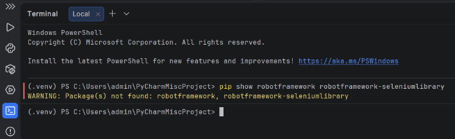

**SetUp Guide**
-

**-1. Check for Python**
-
- Before doing anything, verify that Python is installed on your machine. Open your Terminal (or Command Prompt) and type:
> python --version
- If you see: Python 3.10.x (or higher), you are good to go!
- If you see: "Command not found" or an error, download and install Python from python.org.
- Important: During installation, make sure to check the box that says "Add Python to PATH".

**0. Verification**
-
- Run this command to see if you already have the required libraries:
> pip show robotframework robotframework-seleniumlibrary
- If you see version numbers, you are already set! 
- If you get an error, like the one below, go to Step 1.
> 

**1. Install Dependencies**
- 
- Run this in the PyCharm terminal to install everything at once:
> pip install robotframework robotframework-seleniumlibrary robotframework-jsonlibrary webdriver-manager

**2. Run the Script**
-
- Run this in the PyCharm terminal to start the automation:
> robot -d results scripts/QA_NEW-MANUAL.robot
- **Note:**
- **Error:** ElementClickInterceptedException If you see a long error message saying a button was "not clickable" or "another element would receive the click":
- **What it means:** This is usually a timing issue. The automation tried to click a button while a loading spinner or a "Processing" popup was still covering it.
- **The Fix:** Simply try running the test again.
- **The Rule:** If it fails once but works perfectly on the second run, it confirms that your internet or the website was just slightly slower than the script for a moment. This is a common "flaky" behavior in web automation caused by site animations.